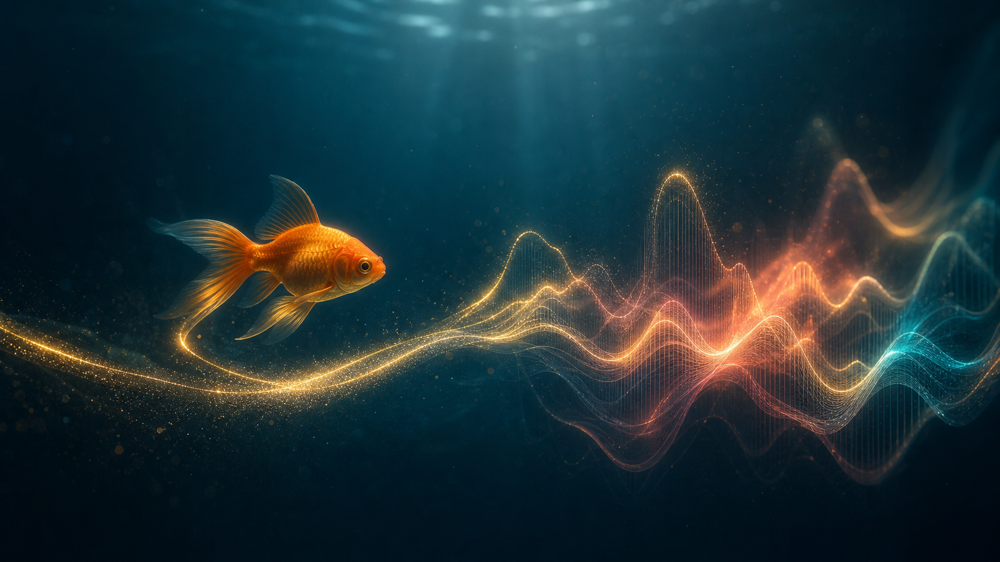

# Swimphony

**Turn a goldfish into a living instrument for sound and ambient light.**



Swimphony is a one-camera web application that tracks a goldfish and converts its movement into generative music and ambient lighting. The submission-first design works with ordinary cameras and includes a virtual-light fallback, so Philips Hue is an enhancement rather than a requirement.

Built during OpenAI Build Week, July 13–21, 2026.

## What is already in this starter

- A working Next.js interface driven by deterministic sample telemetry
- A browser-native sample-video tracker with aquarium ROI, fish-color calibration, mask preview, contour, trail, and confidence fallback
- A shared `FishState` model for camera, video, dual-camera, and future TrueDepth inputs
- A Tone.js audio engine with a tracking-independent note scheduler and clean stop behavior
- A smooth, confidence-aware virtual-light renderer
- A separate projector window with selectable visual presets and a camera-free Golden Trail view
- A local Codex Conductor that turns natural-language moods into validated sound-and-light presets
- Scope, architecture, testing, demo, and Codex handoff documents
- Reference photos of the actual aquarium
- Phase-by-phase Codex prompts

Live-camera input now shares the same calibration and tracking path as sample video. The Hue bridge connection remains optional and the deterministic telemetry path stays available as a fallback.

## Quick start

```bash
cp .env.example .env.local
npm install
npm run dev
```

Open `http://localhost:3000`, press **Start audio**, and the recorded telemetry simulator will drive the sound and virtual light.

On this Mac, double-click `/Users/tada/codex-work/Swimphony/Swimphony.app` instead. It starts the local server when needed and opens Swimphony in Chrome. Startup logs are written to `/tmp/swimphony-dev.log`.

The Codex Conductor uses the locally installed Codex CLI and its existing ChatGPT login, so it needs no separate API key. Run `codex login status` to confirm the local session. If Codex is unavailable, Swimphony keeps running with the built-in safe preset.

## Judge-friendly demo

No aquarium, camera, Hue bridge, or account is required for the deterministic core demo:

1. Run `npm install` and `npm run dev`.
2. Open `http://localhost:3000` in Chrome.
3. Keep **Demo Mode** selected and press **Start audio**.
4. Open **Projection** to see the Golden Trail view.

The included telemetry drives tracking state, music, Virtual Light, and projection. Generating a new AI Conductor preset requires a local Codex login; if it is unavailable, the app returns a validated built-in preset and continues running.

## Local Codex Conductor

Type a mood in **Codex Conductor** and choose **Compose local performance**. The Next.js server starts a short-lived, read-only Codex App Server session, requests one structured preset, validates it with Zod, then applies its sound, mapping, and light rules. The browser never receives Codex credentials and generated values cannot bypass the aquarium safety limits.

Optional tuning lives in `.env.local`:

```text
SWIMPHONY_CODEX_MODEL=gpt-5.6-terra
SWIMPHONY_CODEX_EFFORT=low
SWIMPHONY_CODEX_TIMEOUT_MS=45000
```

## Sample-video tracking

Place an H.264 MP4 at `public/demo/goldfish-demo.mp4`, then:

1. Choose **Sample video**.
2. Drag a rectangle around the aquarium interior.
3. Choose **Sample fish** and click the orange body of the fish.
4. Check the mask preview.
5. Choose **Confirm & track**.

The tracker runs at about 12 Hz while video playback stays smooth. The supplied project keeps user footage out of Git by default; review privacy and rights before publishing a video.

## Live-camera tracking

1. Allow camera access. Live camera is the default source.
2. Select the intended camera if more than one is connected.
3. Drag the aquarium ROI, sample the fish color, and confirm tracking exactly as in sample-video mode.

The selected camera, aquarium ROI, and fish color are saved locally. The next launch restores them and starts tracking automatically. The video frame also follows the camera's real aspect ratio so clicking the fish maps to the correct source pixel. Browser audio still requires one **Start audio** click after a full reload.

If permission is denied or no camera is available, Swimphony returns to the recorded telemetry demo without reloading.

## Projector output

Choose **投影画面** in the header to open a separate audience window. Move that window to the projector and press **全画面**. The operator keeps the camera and controls on the Mac while the audience sees only the generated visual. The first visual preset, **金色の光跡**, turns the tracked position and speed into a slowly fading golden trail. No camera image is sent to the projection window.

## Begin the Codex build

1. Read [`START_HERE.md`](./START_HERE.md).
2. Open this folder as the Codex project.
3. Paste [`CODEX_MASTER_PROMPT.txt`](./CODEX_MASTER_PROMPT.txt) into the primary Codex thread.
4. Then work through the phase prompts in [`prompts/`](./prompts/), beginning with `01-phase1-tracking.md`.
5. Keep the primary Codex thread and record its `/feedback` Session ID in `docs/10-codex-build-log-template.md`.

## How Codex and GPT-5.6 were used

Codex was the implementation partner across the project: it built the tracking and performance modules, connected live camera and sample-video inputs, added audio and lighting adapters, created the projection view, wrote tests, diagnosed browser and Hue behavior, and maintained the decision and build logs. The dated commit history shows the work completed during the Build Week submission period.

The human decisions remained explicit: one ordinary camera is the baseline; deterministic demo mode is permanent; Hue is optional; fish welfare takes priority; and the AI belongs in creative direction rather than the real-time frame loop.

GPT-5.6 performs that bounded creative role. It converts a natural-language mood into a structured `PerformancePreset` for sound, mapping, and light. The server constrains the output with JSON Schema, validates it again with Zod, and clamps all safety-sensitive values. Deterministic TypeScript performs the generated rules in real time.

Primary Codex `/feedback` Session ID: `019f70bf-0594-7060-992f-c464fe304283`.

See [`docs/10-codex-build-log-template.md`](./docs/10-codex-build-log-template.md) for phase evidence and [`docs/09-decision-log.md`](./docs/09-decision-log.md) for key product decisions.

## Submission scope

### Required

- One-camera sample-video and live-camera tracking
- Fish position, speed, direction, area, acceleration, and confidence
- Sound generation
- Virtual ambient light
- GPT-5.6 Codex Conductor through the local Codex App Server
- Demo mode and a polished single-screen interface

### Optional

- Local Philips Hue output

### Deferred

- Two-camera 3D tracking
- iPhone TrueDepth
- Multi-fish identity tracking
- Cloud accounts and storage

## Safety

Swimphony observes the fish passively. It must not use flashes, strobes, abrupt high-brightness changes, tapping, chasing, or other stimuli to force movement. Hue output should illuminate the room or wall indirectly rather than shine strongly into the aquarium.

## Known limitations

- Tracking is tuned for one orange goldfish in a mostly uncluttered aquarium.
- Chrome on macOS is the primary verified browser; Safari and mobile browsers are not fully tested.
- The local AI Conductor requires Codex to be installed and signed in. Its safe fallback works without a login.
- Philips Hue requires a local bridge and server-only credentials; Virtual Light is always available.
- Dual-camera depth, TrueDepth, and multi-fish identity tracking are not implemented.

## Verification

```bash
npm test
npm run lint
npm run build
npm run check:ready
```

The final submission run and manual checks are recorded in [`docs/10-codex-build-log-template.md`](./docs/10-codex-build-log-template.md).

## License

MIT. See [`LICENSE`](./LICENSE).
